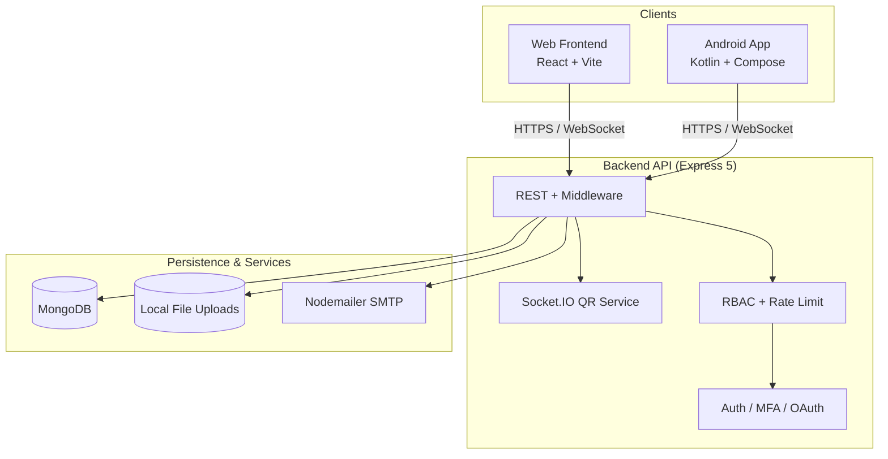

<p align="center">
  
</p>

<p align="center">
  
  
  
</p>

<h1 align="center">🕊️ AidUp</h1>

<p align="center">
  <strong>A full-stack charitable-giving platform that connects donors with verified organizers running transparent humanitarian campaigns.</strong>
</p>

<p align="center">
  <a href="./backend">Backend API</a> ·
  <a href="./frontend">Web Frontend</a> ·
  <a href="./mobile">Android App</a> ·
  <a href="./backend/README.md">API Reference</a>
</p>

---

## 📑 Table of Contents

- [Overview](#-overview)
- [Key Features](#-key-features)
- [Architecture](#-architecture)
- [Technology Stack](#-technology-stack)
- [Project Structure](#-project-structure)
- [Getting Started](#-getting-started)
  - [Prerequisites](#prerequisites)
  - [Backend](#1-backend-api)
  - [Frontend](#2-web-frontend)
  - [Mobile](#3-android-app)
- [Configuration](#-configuration)
- [API Reference](#-api-reference)
- [Security Model](#-security-model)
- [Testing](#-testing)
- [Contributing](#-contributing)
- [Roadmap](#-roadmap)
- [License](#-license)

---

## 🌟 Overview

**AidUp** is a production-grade donation platform engineered to bridge the gap between people who want to help and the organizers running campaigns for those in need — whether that's feeding families, rescuing animals, or delivering humanitarian relief to conflict zones.

The platform is built around three first-class clients that share a single, well-documented REST + WebSocket API:

| Application | Location | Purpose |
| --- | --- | --- |
| **Backend API** | [`backend/`](./backend) | Business logic, authentication, persistence, real-time services |
| **Web Frontend** | [`frontend/`](./frontend) | Responsive browser experience for donors, organizers & admins |
| **Android App** | [`mobile/`](./mobile) | Native mobile experience with QR-code login |

> 💡 This repository (`aidup-final-result`) is the **integrated, final build** of the AidUp platform, combining the backend, web client, and native mobile app into one cohesive product.

---

## ✨ Key Features

<details open>
<summary><b>🔐 Authentication & Identity</b></summary>

- Email / password registration with enforced strong-password policy.
- **JWT auth** — short-lived access tokens (15 min) + `httpOnly` refresh cookies (7 days).
- **Google OAuth** sign-in (`google-auth-library`).
- **TOTP Multi-Factor Authentication** — setup, verify, enable/disable, and step-up login.
- Email verification codes on signup and password reset flows.
- Role-based access control for **Donator**, **Organizer**, and **Admin**.

</details>

<details open>
<summary><b>📱 Cross-Device QR Login</b></summary>

- A PC browser generates a session QR code; a logged-in mobile app scans and approves it.
- Real-time approval delivered over a **Socket.IO** channel (`qr:authenticated` event).
- No password re-entry on secondary devices.

</details>

<details open>
<summary><b>📢 Campaigns & Donations</b></summary>

- Organizers create, update, and delete campaigns with images, videos, categories, goals, and payment methods.
- Donors browse, search, and contribute with **proof-of-payment** uploads.
- Donations flow through `pending → approved / rejected` moderation states.
- Public, read-only browsing of campaigns, organizers, and donors.

</details>

<details open>
<summary><b>🛡️ Admin & Moderation</b></summary>

- Dashboard for overseeing users, campaigns, and verification requests.
- Organizer verification review (documents + images).
- Donation approvals and full **audit logging**.

</details>

<details open>
<summary><b>🧱 Security Hardening</b></summary>

- `helmet`, MongoDB query sanitization, HTTP parameter pollution protection.
- Rate limiting on authentication routes.
- Centralized error handling and structured `pino` request logging.

</details>

---

## 🏗️ Architecture



**Request flow:** Clients authenticate and receive a bearer access token + refresh cookie. Protected routes are gated by `verifyJWT` + `authorize(role)` middleware; file uploads pass through `advancedUpload` (size/type validation, image hashing via `sharp`); all privileged actions are recorded in an `AuditLog`.

---

## 🧰 Technology Stack

### Backend


| Concern | Library |
| --- | --- |
| Web framework | `express@5` |
| ODM | `mongoose@9` |
| Auth & crypto | `jsonwebtoken`, `bcryptjs`, `otplib`, `google-auth-library` |
| Validation | `zod` |
| Real-time | `socket.io` / `socket.io-client` |
| Security | `helmet`, `@exortek/express-mongo-sanitize`, `hpp`, `express-rate-limit` |
| Uploads & media | `multer`, `sharp` |
| Email | `nodemailer` |
| Logging | `pino`, `pino-http`, `pino-pretty` |

### Frontend


`react@19` · `react-router-dom@7` · `zustand` (state) · `axios` (API) · `framer-motion` + `gsap` + `lenis` (motion) · `lucide-react` (icons) · `html5-qrcode` · `socket.io-client`.

> A polished **Next.js 16** marketing homepage is also included under `frontend/modern-homepage`.

### Mobile


`Jetpack Compose` (Material 3) · `Navigation Compose` · `Retrofit` + `OkHttp` · `CameraX` + `ZXing` (QR) · `Coil` · `DataStore` / Encrypted `SharedPreferences` · `Credential Manager` (Google) · `Biometric` · `ViewModel`.

---

## 📂 Project Structure

```text
aidup-final-result/
├── backend/                      # 🔧 Express API + Socket.IO service
│   ├── app.js                    #   Express wiring, global middleware, route mounting
│   ├── server.js                 #   HTTP server, DB connect, Socket.IO bootstrap
│   ├── config/                   #   CORS & DB options
│   ├── controllers/              #   Request handlers (auth, campaign, donation, admin…)
│   ├── middleware/               #   JWT auth, RBAC, uploads, rate-limit, audit, validation
│   ├── models/                   #   Mongoose schemas
│   ├── routes/                   #   Express routers
│   ├── public/                   #   Public read-only routes
│   ├── services/                 #   Email & QR-auth services
│   ├── sockets/                  #   Socket.IO QR-login channel
│   ├── utils/                    #   Validators, tokens, image hashing, logger
│   ├── scripts/                  #   Seed / admin / cleanup scripts
│   ├── uploads/                  #   User media (git-ignored)
│   └── README.md                 #   Full API reference
│
├── frontend/                     # 💻 React + Vite web client
│   ├── src/
│   │   ├── api/                  #   Axios clients per domain
│   │   ├── components/           #   UI, layout, route guards, welcome sections
│   │   ├── hooks/                #   Auth, campaigns, donations, search…
│   │   ├── pages/                #   Route screens
│   │   └── assets/
│   ├── modern-homepage/          #   Optional Next.js marketing site
│   └── README.md
│
└── mobile/                       # 📱 Android app (Kotlin + Compose)
    ├── app/src/main/java/com/aidup/app/
    │   ├── models/               #   Domain + auth/campaign/donation models
    │   ├── network/              #   Retrofit client, token & DataStore managers
    │   ├── repository/           #   API repository layer
    │   ├── ui/screens/           #   ~20 Compose screens
    │   ├── ui/viewmodels/        #   Per-feature ViewModels
    │   ├── ui/theme/             #   Material 3 theming
    │   ├── navigation/           #   Compose Navigation graph
    │   └── utils/                #   File, network, QR-code helpers
    └── README.md
```

---

## 🚀 Getting Started

### Prerequisites

- **Node.js** ≥ 18
- **MongoDB** (local `mongodb://localhost:27017/aidup` or Atlas)
- **Android Studio** (Arctic Fox or newer) for the mobile app
- An **SMTP** account (Gmail example included) for email flows

> ⚠️ The repo ships a committed `backend/.env` containing **placeholder/test secrets**. Generate your own secrets and never deploy it as-is.

### 1. Backend API

```bash
cd backend
npm install
# review/edit backend/.env  (see Configuration below)
npm run dev      # → http://localhost:5000
```

| Script | Description |
| --- | --- |
| `npm run dev` | Start the API (`node server.js`) |
| `npm start` | Production-style launch |

### 2. Web Frontend

```bash
cd frontend
npm install
npm run dev      # Vite dev server (default http://localhost:5173)
npm run build    # type-check + production build
npm run lint     # ESLint
```

Optional Next.js marketing homepage:

```bash
cd frontend/modern-homepage
npm install
npm run dev
```

### 3. Android App

1. Open `mobile/` in **Android Studio**.
2. **Sync Gradle** (pulls Compose BOM 2024.12, Retrofit, CameraX, DataStore, Credential Manager).
3. Run on an emulator or physical device (minSdk 24 / targetSdk 34).

---

## ⚙️ Configuration

Create or edit `backend/.env`:

| Variable | Purpose |
| --- | --- |
| `PORT` | API port (default `5000`) |
| `NODE_ENV` | `development` / `production` |
| `MONGO_URI` | MongoDB connection string |
| `JWT_SECRET` | Access-token signing key |
| `REFRESH_TOKEN_SECRET` | Refresh-token signing key |
| `GOOGLE_CLIENT_ID` | Google OAuth client ID |
| `FRONTEND_URL` | Allowed CORS origin |
| `EMAIL_USER` | SMTP username (e.g. Gmail) |
| `EMAIL_PASS` | SMTP app password |

---

## 📡 API Reference

The backend exposes a **versionless REST API** plus a Socket.IO channel for QR login. All protected routes expect `Authorization: Bearer <accessToken>`.

| Area | Methods | Routes |
| --- | --- | --- |
| **Auth core** | `POST` | `/auth/register`, `/auth/login`, `/auth/google-login` |
| **MFA (TOTP)** | `POST` | `/auth/mfa/setup`, `/auth/mfa/verify`, `/auth/mfa/disable`, `/auth/mfa/verify-login` |
| **Email / Password** | `POST` | `/auth/verify-registration-email`, `/auth/forgot-password`, `/auth/reset-password` |
| **QR Login** | `POST`/`GET` | `/auth/qr/create`, `/auth/qr/scan/:id`, `/auth/qr/approve`, `/auth/qr/status/:id` |
| **Sessions** | `GET`/`POST` | `/auth/refresh`, `/auth/logout` |
| **Campaigns** | `POST`/`PUT`/`DELETE` | `/campain/managecampain/*` |
| **Organizers** | `GET`/`POST`/`DELETE` | `/organizor/*` (account, dashboard, verification, campaigns) |
| **Donators** | `GET`/`POST`/`DELETE` | `/donator/*` (account, donations) |
| **Donations** | `POST`/`GET` | `/donation/createDonation`, `/donation/*` |
| **Categories** | `GET` | `/category/getall` |
| **Public data** | `GET` | `/publicca/*`, `/publicor/*`, `/publicdo/*` |
| **Admin** | `GET`/`PUT`/`DELETE` | `/admin/*` (users, campaigns, verifications, donations, audit logs) |

📘 Full request/response contracts, schemas, and examples: **[`backend/README.md`](./backend/README.md)**.

---

## 🔐 Security Model

| Layer | Implementation |
| --- | --- |
| Transport & headers | `helmet`, CORS allow-list |
| Injection / pollution | `@exortek/express-mongo-sanitize`, `hpp` |
| Brute-force protection | `express-rate-limit` on `/auth` |
| Token strategy | Access (15 m) in body + Refresh (7 d) in `httpOnly` cookie |
| Authorization | `verifyJWT` → `authorize(role)` middleware chain |
| File safety | `advancedUpload` (type/size limits) + `sharp` image hashing |
| Auditability | `AuditLog` model + `auditLog` middleware on privileged actions |
| Observability | `pino` / `pino-http` structured request logging |

---

## 🧪 Testing

- **Backend:** runtime smoke via the API; helper scripts in `backend/scripts/` (`seed.js`, `createAdmin.js`, `clear_test_user.js`).
- **Mobile:** `app/src/test/java/com/aidup/app/AidItemTest.kt` (JUnit) plus Android instrumented tests.
- **Frontend:** ESLint + TypeScript type-checking enforced in the build pipeline.

---

## 🤝 Contributing

1. Fork the repository and create a feature branch (`git checkout -b feature/awesome`).
2. Follow existing conventions:
   - **Backend:** controller → service → route, with `zod` validation and RBAC middleware.
   - **Frontend:** feature folders under `pages/` + `components/`, state via Zustand hooks.
   - **Mobile:** Compose `ViewModel` + `repository` + `network` layer separation.
3. Run linters/builds before opening a PR.
4. Backend contributor guide: `frontend/CONTRIBUTING_BACKEND.md`.

---

## 🗺️ Roadmap

- [ ] Payment gateway integration (Stripe / PayPal) beyond proof-of-payment uploads.
- [ ] Real-time donation progress notifications via WebSockets.
- [ ] Organizer analytics dashboard enhancements.
- [ ] Localization / i18n for web and mobile.
- [ ] CI/CD pipeline (lint, test, build) across all three apps.

---

## 📄 License

Distributed under the **MIT License**. See individual component READMEs for details.

---

<p align="center">
  <i>"No one has ever become poor by giving."</i> — Anne Frank
</p>
