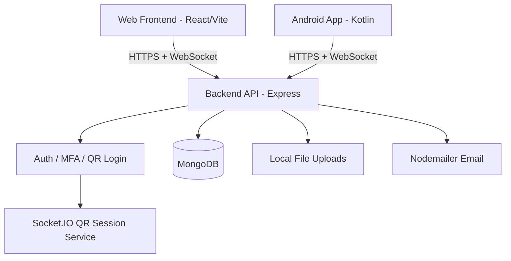

# 🕊️ AidUp

**AidUp** is a full-stack charitable-giving platform that connects **donators** with **organizers** running humanitarian campaigns. It lets organizers publish transparent campaigns (people, animals, countries in need), lets donors discover, track, and verify their contributions, and gives admins the tools to moderate the ecosystem.

The final, integrated result lives here, composed of three coordinated applications:

| App | Path | Stack |
| --- | --- | --- |
| **Backend API** | [`backend/`](./backend) | Node.js · Express 5 · MongoDB (Mongoose) · Socket.IO |
| **Web Frontend** | [`frontend/`](./frontend) | React 19 · TypeScript · Vite · Tailwind CSS 4 · Zustand |
| **Android Mobile** | [`mobile/`](./mobile) | Kotlin · Jetpack Compose · Retrofit · CameraX |

---

## 🏗️ System Architecture



All clients (web + mobile) share the same REST + WebSocket API defined in [`backend/README.md`](./backend/README.md).

---

## ✨ Core Features

- **Multi-role accounts** — Donators, Organizers, and Admins, each with isolated routes and permissions.
- **Secure authentication**
  - Email/password registration with strong password policy (12+ chars, mixed case, numbers, symbols).
  - JWT access tokens (15 min) + httpOnly refresh cookies (7 days).
  - Google OAuth login (`google-auth-library`).
  - **TOTP Multi-Factor Authentication** (setup, verify, enable/disable, login step-up).
  - Email verification codes on signup.
- **QR Code Login 📱** — A logged-in mobile device scans a PC-generated QR code and approves a session over a Socket.IO channel (`/auth/qr/*`).
- **Campaign management** — Organizers create/update/delete campaigns with images & videos, categories, goals, and accepted payment methods.
- **Donations** — Donators contribute with proof-of-payment uploads; donations carry `pending → approved/rejected` states.
- **Public browsing** — Guests can view public campaigns, organizers, and donators (`/publicca`, `/publicor`, `/publicdo`).
- **Admin panel 🛡️** — Moderate organizers, donors, campaigns, verification requests, donations, and audit logs.
- **Security hardening** — Helmet, mongo-sanitize, HPP, rate limiting on auth routes, audit logging, and centralized error handling.

---

## 📂 Project Structure

```text
aidup-final-result/
├── backend/                 # Express API + Socket.IO service
│   ├── app.js               # Express app, middleware, route mounting
│   ├── server.js            # HTTP server + DB connect + Socket.IO init
│   ├── config/              # CORS, DB options
│   ├── controllers/         # Request handlers (auth, campaign, donation, ...)
│   ├── middleware/          # Auth, RBAC, upload, rate-limit, audit, validation
│   ├── models/              # Mongoose schemas
│   ├── routes/              # Express routers
│   ├── public/              # Public read-only routes
│   ├── services/            # Email + QR auth services
│   ├── sockets/             # Socket.IO QR login
│   ├── utils/               # Validators, token & image helpers, logger
│   ├── scripts/             # Seed / admin / cleanup scripts
│   ├── uploads/             # User-uploaded media (git-ignored)
│   └── README.md            # Full API reference
│
├── frontend/                # React + Vite web client
│   ├── src/
│   │   ├── api/             # Axios clients (auth, campaign, donation, ...)
│   │   ├── components/      # UI, layout, guards, welcome sections
│   │   ├── hooks/           # Auth, campaigns, donations, search, ...
│   │   ├── pages/           # Route screens
│   │   └── assets/
│   ├── modern-homepage/     # Optional Next.js marketing homepage
│   └── README.md
│
└── mobile/                  # Android app (Kotlin + Jetpack Compose)
    ├── app/src/main/java/com/aidup/app/
    │   ├── models/          # Data + auth/campaign/donation models
    │   ├── network/         # Retrofit client, token & DataStore managers
    │   ├── repository/      # API repository layer
    │   ├── ui/screens/      # ~20 Compose screens
    │   ├── ui/viewmodels/   # ViewModels per feature
    │   ├── ui/theme/        # Material 3 theming
    │   ├── navigation/      # Compose Navigation graph
    │   └── utils/           # File, network, QR-code helpers
    └── README.md
```

---

## 🚀 Getting Started

### Prerequisites

- **Node.js** v18+
- **MongoDB** (local `mongodb://localhost:27017/aidup` or Atlas URI)
- **Android Studio** (Arctic Fox+) for the mobile app
- A **Gmail** account (or other SMTP) for email / verification flows

> ⚠️ The repository ships a committed `backend/.env` with placeholder/test secrets. Generate your own secrets before any real deployment.

### 1. Backend

```bash
cd backend
npm install
# review/edit backend/.env (see Environment Variables below)
npm run dev        # starts on http://localhost:5000
```

Notable scripts (`backend/package.json`):

| Script | Description |
| --- | --- |
| `npm run dev` | Run the API (`node server.js`) |
| `npm start` | Same as `dev` for production-style launch |

### 2. Frontend (web)

```bash
cd frontend
npm install
npm run dev        # Vite dev server (default http://localhost:5173)
npm run build      # type-check + production build
npm run lint       # ESLint
```

An optional standalone marketing homepage lives in `frontend/modern-homepage` (Next.js 16):

```bash
cd frontend/modern-homepage
npm install
npm run dev
```

### 3. Mobile (Android)

1. Open `mobile/` in **Android Studio**.
2. **Sync Gradle** to pull dependencies (Jetpack Compose BOM 2024.12, Retrofit, CameraX, DataStore, Credential Manager).
3. Run on an emulator or physical device (minSdk 24 / API 34).

---

## 🔐 Environment Variables (backend)

Create or edit `backend/.env`:

| Variable | Purpose |
| --- | --- |
| `PORT` | API port (default `5000`) |
| `NODE_ENV` | `development` / `production` |
| `MONGO_URI` | MongoDB connection string |
| `JWT_SECRET` | Access-token signing key |
| `REFRESH_TOKEN_SECRET` | Refresh-token signing key |
| `GOOGLE_CLIENT_ID` | Google OAuth client ID |
| `FRONTEND_URL` | Allowed CORS origin |
| `EMAIL_USER` | SMTP username (e.g. Gmail) |
| `EMAIL_PASS` | SMTP app password |

---

## 📡 API Overview

The backend exposes a versionless REST API plus a Socket.IO channel for QR login. Highlights:

- `POST /auth/register`, `/auth/login`, `/auth/google-login`
- `POST /auth/mfa/*` — TOTP setup/verify/disable + step-up login
- `POST /auth/verify-registration-email`, `/auth/forgot-password`, `/auth/reset-password`
- `/auth/qr/*` + Socket.IO `qr:authenticated` event — cross-device login
- `GET /auth/refresh`, `POST /auth/logout` — session management
- `/campain/*` — organizer campaign CRUD
- `/donator/*`, `/donation/*` — donor account + donations
- `/organizor/*` — organizer account, verification, dashboard
- `/category/*`, `/publicca`, `/publicor`, `/publicdo` — browse data
- `/admin/*` — moderation, verification review, audit logs

Full request/response contracts: **[`backend/README.md`](./backend/README.md)**.

---

## 🧪 Testing

- **Backend:** runtime smoke via API; `backend/scripts/` for seeding/cleanup.
- **Mobile:** `app/src/test/java/com/aidup/app/AidItemTest.kt` (JUnit) plus Instrumented tests.
- **Frontend:** ESLint + TypeScript type-check in the build pipeline.

---

## 🤝 Contributing

1. Fork the repo and create a feature branch (`git checkout -b feature/...`).
2. Follow existing conventions — controllers → services → routes, Zod validation in the backend, Compose ViewModels on mobile.
3. Run linters/builds before opening a PR.
4. Backend contributor guide: `frontend/CONTRIBUTING_BACKEND.md`.

---

## 📄 License

Distributed under the MIT License. See individual component READMEs for details.
