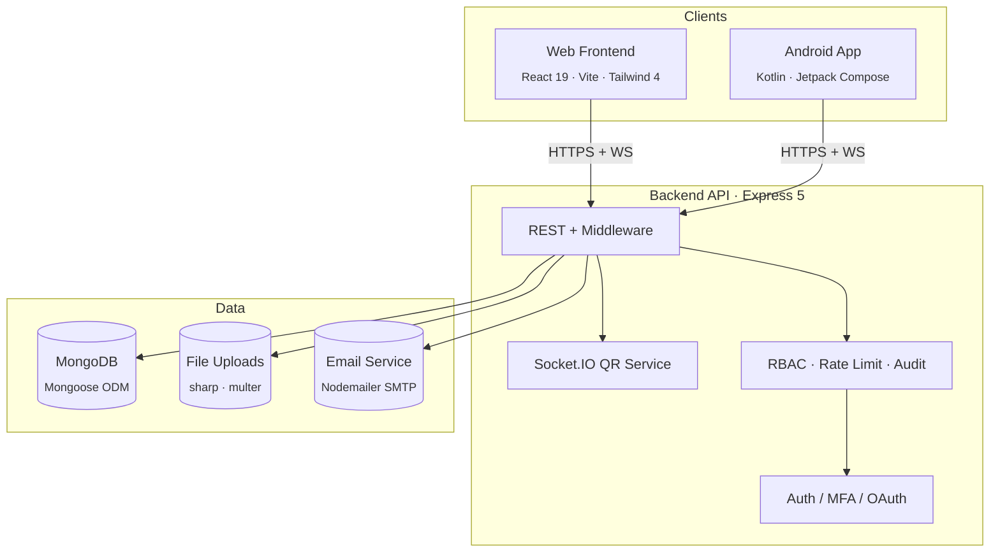

<div align="center">
  
  <h1>🕊️ AidUp</h1>
  <p><strong>Transparent Charitable Giving — From People Who Care, to Causes That Matter</strong></p>

  <p align="center">
    <a href="#key-features"></a>
    <a href="https://github.com/Nciibi/aidup-platform"></a>
    <a href="./backend/README.md"></a>
    <br>
    
    
    
    
    
    
  </p>
</div>

---

AidUp is a **production-grade**, full-stack charitable platform that connects donors with verified campaign organizers. Built for transparency, security, and scale — across **web** and **mobile** — with a single shared API.

We believe in making giving **accessible**, **verifiable**, and **impactful**.

<div align="center">
  
</div>

> 🎯 **Perfect for**: Non-profit tech teams, hackathon projects, portfolio showcases, and anyone building mission-driven platforms.

---

## 📋 Table of Contents

- [Why AidUp?](#why-aidup)
- [Quick Start](#quick-start)
- [Key Features](#key-features)
- [Architecture](#architecture)
- [Technology Stack](#technology-stack)
- [Project Structure](#project-structure)
- [Getting Started in Detail](#getting-started-in-detail)
- [Environment Variables](#environment-variables)
- [API Map](#api-map)
- [Security Deep-Dive](#security-deep-dive)
- [Testing & Quality](#testing--quality)
- [Contributing](#contributing)
- [Roadmap](#roadmap)
- [License](#license)

---

## 💡 Why AidUp?

| For | AidUp delivers |
|---|---|
| **Job candidates** | A production-grade full-stack (+ native mobile) architecture you can point to. MERN + Kotlin/Compose, JWT auth, TOTP MFA, WebSockets, RBAC, audit logging, file pipelines — all in one repo. |
| **Contributors** | Clean separation of concerns, documented APIs, Zod-validated inputs, consistent coding patterns across backend/frontend/mobile, and a welcoming issue tracker. |
| **Non-profits** | A ready-to-deploy donation platform with organizer verification, transparent campaign tracking, and multi-platform reach (web + Android). |
| **Developers** | Modern tooling: React 19, Vite 8, Tailwind 4, TypeScript 6, Kotlin Compose, CameraX, Socket.IO, and more. |

---

## 🪄 Quick Start

```bash
# Backend
cd backend && npm install && npm run dev          # → http://localhost:5000

# Frontend (in another terminal)
cd frontend && npm install && npm run dev           # → http://localhost:5173

# Mobile (Android Studio)
# Open mobile/ → Sync Gradle → Run on device
```

<details>
<summary><b>📋 Prerequisites</b></summary>

| Dependency | Version | Notes |
|------------|---------|-------|
| Node.js | ≥ 18 | Required for backend + frontend |
| npm | ≥ 9 | Ships with Node |
| MongoDB | ≥ 6 | Local or Atlas — configurable via `.env` |
| Android Studio | Arctic Fox+ | For the mobile app |
| Java JDK | 17 | Gradle requirement |

</details>

---

## ✨ Key Features

### 🔐 Enterprise-Grade Authentication
| Capability | Implementation |
|---|---|
| **Email/Password** | Strong-policy registration (12+ chars, upper, lower, num, special) |
| **JWT Sessions** | Access tokens (15 m) + `httpOnly` refresh cookies (7 d) |
| **Google OAuth** | Seamless one-tap sign-in |
| **TOTP MFA** | App-based 2FA with setup, verify, and step-up login |
| **Email Verification** | 6-digit codes on signup and password reset |
| **Role-Based Access** | `donator` · `organizer` · `admin` — isolated route guards |

### 📱 Cross-Device QR Login
- PC generates a session; mobile scans and approves in real time via **Socket.IO**
- No password re-entry on secondary devices — frictionless UX

### 📢 Campaign Engine
- **Organizers** create campaigns with images, videos, categories, and funding goals
- **Donors** contribute with proof-of-payment uploads
- Transparent `pending → approved / rejected` moderation workflow
- Public browseable catalog for guests

### 🛡️ Admin Moderation Suite
- Dashboard for overseeing users, campaigns, and verification requests
- Document-based organizer verification review
- Full **audit logging** on all privileged actions

---

## 🏗️ Architecture



**Data flow:** Clients authenticate → receive bearer token + refresh cookie. Protected routes gate via `verifyJWT` → `authorize(role)`. File uploads validate type/size and hash images via `sharp`. Every privileged action records an `AuditLog` entry. QR sessions use Socket.IO for real-time approval.

---

## 🧰 Technology Stack

<details open>
<summary><b>Backend API</b></summary>

| Category | Choice | Why |
|---|---|---|
| **Runtime** | Node.js 22 | Async I/O, massive ecosystem |
| **Framework** | Express 5 | Battle-tested, modular middleware |
| **Database** | MongoDB + Mongoose 9 | Flexible schemas, rich queries |
| **Auth** | `jsonwebtoken` · `bcryptjs` · `otplib` · `google-auth-library` | JWT + bcrypt + TOTP + OAuth |
| **Validation** | Zod 4 | Runtime type safety |
| **Real-time** | Socket.IO 4 | Bidirectional event channels |
| **Security** | `helmet` · `@exortek/express-mongo-sanitize` · `hpp` · `express-rate-limit` | Defense in depth |
| **Media** | `multer` · `sharp` | Upload + image processing |
| **Email** | `nodemailer` | SMTP integration |
| **Logging** | `pino` · `pino-http` · `pino-pretty` | Structured JSON logs |

</details>

<details open>
<summary><b>Web Frontend</b></summary>

| Category | Choice |
|---|---|
| **Framework** | React 19 + TypeScript 6 |
| **Bundler** | Vite 8 |
| **Routing** | react-router-dom 7 |
| **State** | Zustand 5 |
| **Styling** | Tailwind CSS 4 |
| **Animation** | framer-motion 12 · GSAP 3 · Lenis |
| **HTTP** | Axios · socket.io-client |
| **Auth (web)** | @react-oauth/google · html5-qrcode |

> Also includes a standalone **Next.js 16** marketing homepage under `frontend/modern-homepage`.

</details>

<details open>
<summary><b>Android App</b></summary>

| Category | Choice |
|---|---|
| **Language** | Kotlin |
| **UI** | Jetpack Compose · Material 3 |
| **Navigation** | Navigation Compose |
| **Networking** | Retrofit 2 · OkHttp 4 · Gson |
| **Camera** | CameraX · ZXing (QR) |
| **Auth** | Credential Manager · Biometric |
| **Storage** | DataStore · Encrypted SharedPreferences |
| **Images** | Coil |
| **Min SDK** | 24 (Android 7.0) |
| **Target SDK** | 34 (Android 14) |

</details>

---

## 📂 Project Structure

```
aidup-final-result/
│
├── backend/                          # 🔧 Express API
│   ├── app.js                        #   Middleware wiring · route mounting
│   ├── server.js                     #   HTTP server · DB connect · Socket.IO
│   ├── config/                       #   CORS · DB options
│   ├── controllers/                  #   Route handlers (auth, campaign, …)
│   ├── middleware/                   #   JWT · RBAC · upload · audit · rate-limit
│   ├── models/                       #   Mongoose schemas
│   ├── routes/                       #   Express routers
│   ├── services/                     #   Email · QR auth logic
│   ├── sockets/                      #   Socket.IO QR channel
│   ├── utils/                        #   Validators · tokens · image · logger
│   ├── scripts/                      #   Seed · admin · cleanup
│   └── README.md                     #   📘 Full API reference
│
├── frontend/                         # 💻 React + Vite
│   ├── src/
│   │   ├── api/                      #   Axios clients per domain
│   │   ├── components/               #   UI · layout · guards · sections
│   │   ├── hooks/                    #   Auth · campaigns · donations · search
│   │   ├── pages/                    #   Route screens (~15 pages)
│   │   └── assets/
│   ├── modern-homepage/              #   Next.js marketing site
│   └── README.md
│
└── mobile/                           # 📱 Android (Kotlin + Compose)
    ├── app/src/main/java/com/aidup/app/
    │   ├── models/                   #   Domain + DTOs
    │   ├── network/                  #   Retrofit · token · DataStore managers
    │   ├── repository/               #   API abstraction layer
    │   ├── ui/screens/               #   20+ Compose screens
    │   ├── ui/viewmodels/            #   ViewModels per feature
    │   ├── ui/theme/                 #   Material 3 theming
    │   └── navigation/               #   Navigation graph
    └── README.md
```

---

## 🚀 Getting Started in Detail

### 1. Backend API

```bash
cd backend
npm install
cp .env .env.local          # optional — edit as needed
npm run dev                  # → http://localhost:5000
```

Available scripts:

| Script | Purpose |
|---|---|
| `npm run dev` | Start API server |
| `npm start` | Production launch |
| `node scripts/seed.js` | Seed sample data |
| `node scripts/createAdmin.js` | Bootstrap admin account |

### 2. Web Frontend

```bash
cd frontend
npm install
npm run dev                  # → http://localhost:5173
npm run build                # Type-check + production bundle
npm run lint                 # ESLint
```

Or launch the marketing homepage:

```bash
cd frontend/modern-homepage
npm install
npm run dev                  # → http://localhost:3000
```

### 3. Android App

| Step | Action |
|---|---|
| 1 | Open `mobile/` in Android Studio |
| 2 | Let Gradle sync (BOM 2024.12, Compose, Retrofit, CameraX) |
| 3 | Select a device (emulator or physical, minSdk 24) |
| 4 | Run ▶ |

---

## ⚙️ Environment Variables

Configure via `backend/.env`:

```env
# Required
PORT=5000
NODE_ENV=development
MONGO_URI=mongodb://localhost:27017/aidup
JWT_SECRET=<your-secret>
REFRESH_TOKEN_SECRET=<your-secret>

# Optional (feature-dependent)
GOOGLE_CLIENT_ID=<for-oauth-login>
FRONTEND_URL=http://localhost:5173
EMAIL_USER=<smtp-user>
EMAIL_PASS=<smtp-password>
```

> ⚠️ The repo ships placeholder values. **Never deploy with default secrets.**

---

## 📡 API Map

All endpoints are prefixed with the categories below. Authenticated routes require `Authorization: Bearer <accessToken>`.

| Area | Key Endpoints |
|---|---|
| **Auth** | `POST /auth/register` · `POST /auth/login` · `POST /auth/google-login` |
| **MFA** | `POST /auth/mfa/setup` · `POST /auth/mfa/verify` · `POST /auth/mfa/verify-login` |
| **Email** | `POST /auth/verify-registration-email` · `POST /auth/forgot-password` |
| **QR Login** | `POST /auth/qr/create` · `GET /auth/qr/scan/:id` · `POST /auth/qr/approve` |
| **Sessions** | `GET /auth/refresh` · `POST /auth/logout` |
| **Campaigns** | `POST /campain/managecampain/add` · `PUT …/update/:id` · `DELETE …/delete/:id` |
| **Donations** | `POST /donation/createDonation` · `GET /donator/readdonaions/*` |
| **Organizers** | `GET /organizor/dashboard` · `POST /organizor/submitVerification` |
| **Public** | `GET /publicca/all` · `GET /publicor/all` · `GET /publicdo/all` |
| **Admin** | `GET /admin/getAllUsers` · `PUT /admin/updateVerification/:id` · `GET /admin/getAllAuditLogs` |

📘 **Full request/response schemas** → [`backend/README.md`](./backend/README.md)

---

## 🔐 Security Deep-Dive

| Layer | Protection |
|---|---|
| **HTTP Headers** | `helmet` — CSP, HSTS, X-Frame-Options, etc. |
| **CORS** | Whitelist origins via `FRONTEND_URL` |
| **Query Injection** | Mongo-sanitize + parameterized Mongoose |
| **HTTP Pollution** | `hpp` middleware |
| **Rate Limiting** | 100 req / 15 min on `/auth` routes |
| **Password Policy** | ≥ 12 chars · mixed case · digits · symbols |
| **Tokens** | Access (15 m, in response) + Refresh (7 d, `httpOnly` cookie) |
| **MFA** | TOTP (time-based one-time password) via authenticator apps |
| **File Uploads** | Type/extension validation + `sharp` image hashing |
| **Audit Trail** | Every admin + organizer action logged to `AuditLog` |
| **Request Logging** | Structured JSON via `pino-http` |

---

## 🧪 Testing & Quality

| Area | Tools & Practices |
|---|---|
| **Frontend** | TypeScript strict mode · ESLint · React compiler |
| **Backend** | Zod runtime validation · Audit logging |
| **Mobile** | JUnit 4 · AndroidX Test · Espresso · Compose UI Tests |
| **Scripts** | `seed.js` · `createAdmin.js` · `clear_test_user.js` |

---

## 🤝 Contributing

We welcome contributions from developers of all skill levels.

```bash
git clone https://github.com/Nciibi/aidup-platform.git
git checkout -b feature/<your-idea>
# Make your changes
npm run lint
git commit -m "feat: add <your-feature>"
git push origin feature/<your-idea>
# Open a Pull Request 🚀
```

**Coding conventions:**
- **Backend:** `zod` validation → `controller` → `service` → `route`
- **Frontend:** Feature folder in `pages/` + `components/`, state via Zustand
- **Mobile:** `ViewModel` → `repository` → `network` layering

Read the **[Backend Contributor Guide](./frontend/CONTRIBUTING_BACKEND.md)** for detailed patterns.

---

## 🗺️ Roadmap

- [ ] **Payment Gateway** — Stripe / PayPal integration
- [ ] **Live Notifications** — WebSocket push for donation updates
- [ ] **Analytics Dashboard** — Organizer campaign insights
- [ ] **i18n** — Multi-language support (web + mobile)
- [ ] **CI/CD Pipeline** — Automated lint, test, build for all apps
- [ ] **Push Notifications** — Mobile alerts for donations and approvals

---

## 📄 License

Distributed under the **MIT License**.

---

<p align="center">
  Made with ❤️ for a better world.<br>
  <i>"No one has ever become poor by giving."</i> — Anne Frank
</p>

<p align="center">
  <a href="#aidup">⬆ Back to Top</a>
</p>
