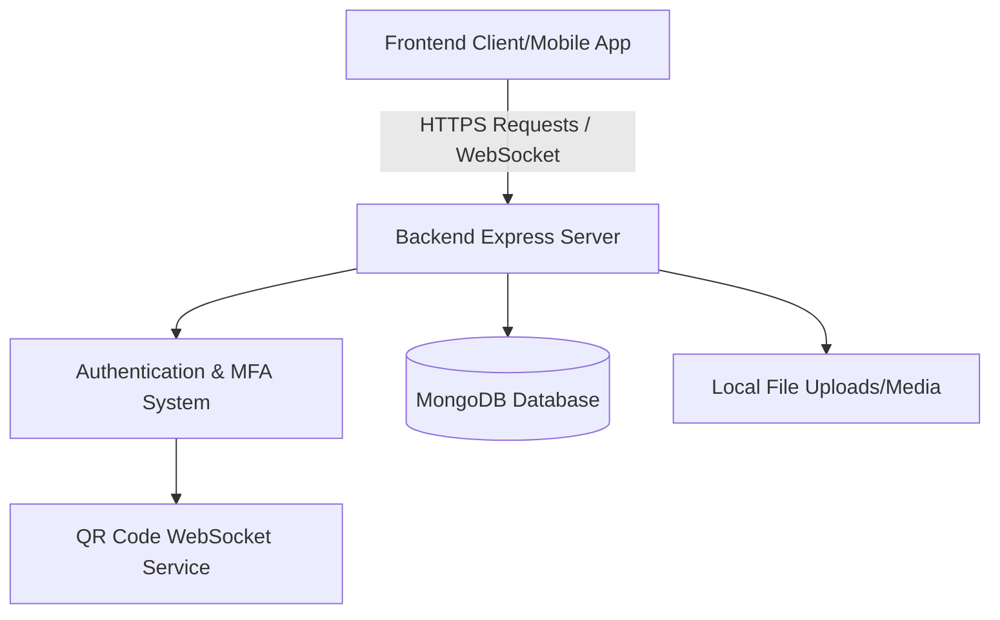

# AidUp

Welcome to **AidUp**! 🚀

AidUp is a comprehensive platform designed to bridge the gap between donators and organizers who run charitable campaigns. Our platform empowers organizers to create transparent campaigns and makes it easy for individuals to securely donate, track their contributions, and ensure their donations are reaching those in need.

## 🌟 Project Overview

AidUp is divided into two main components:
- **Frontend** (`AIDUPFRONTEND/`): The user interface for donators, organizers, and administrators, built to provide a seamless and secure experience.
- **Backend** (`aidup-backend/`): The robust API layer that handles business logic, security, multi-factor authentication (MFA), database management, and integrations.

## 🏗️ System Architecture



## 🚀 Quick Start Guide

To run the project locally, you will need to start both the backend and frontend separately.

### Prerequisites
- Node.js (v18+)
- MongoDB instance (local or Atlas)

### 1. Starting the Backend

1. Navigate to the backend directory:
   ```bash
   cd aidup-backend
   ```
2. Install dependencies:
   ```bash
   npm install
   ```
3. Set up environment variables:
   Ensure you have a `.env` file in the `aidup-backend` folder containing the necessary keys (Database URI, JWT Secrets, etc.).
4. Start the server (development mode):
   ```bash
   npm run dev
   ```
   *The backend should now run on `http://localhost:5000`.*

### 2. Starting the Frontend
1. Open a new terminal and navigate to the frontend directory:
   ```bash
   cd AIDUPFRONTEND
   ```
2. Install frontend dependencies and start your app (commands depend on the framework used).


## 📚 Documentation

Detailed documentation is available in the respective backend directory:

- [Backend API Documentation](./aidup-backend/README.md): Detailed explanation of all available endpoints, request/response formats, and authentication.
- [Backend Contributor Guide](./aidup-backend/CONTRIBUTING_BACKEND.md): Best practices, architecture details, and how to add new features to the backend.

## 🤝 Contributing
We welcome contributions! If you're looking to contribute to the backend, please check out the **[Backend Contributor Guide](./aidup-backend/CONTRIBUTING_BACKEND.md)** for best practices on writing routes, controllers, and models.
