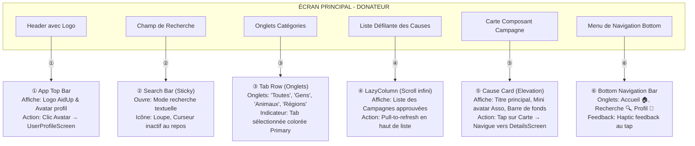
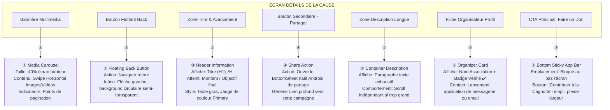
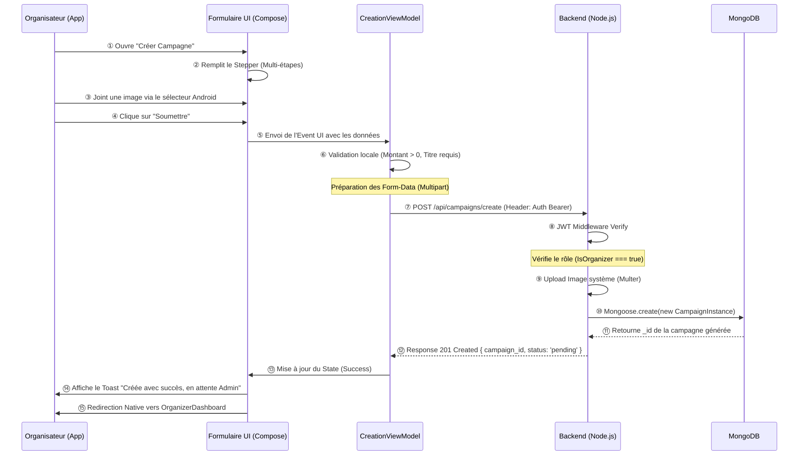
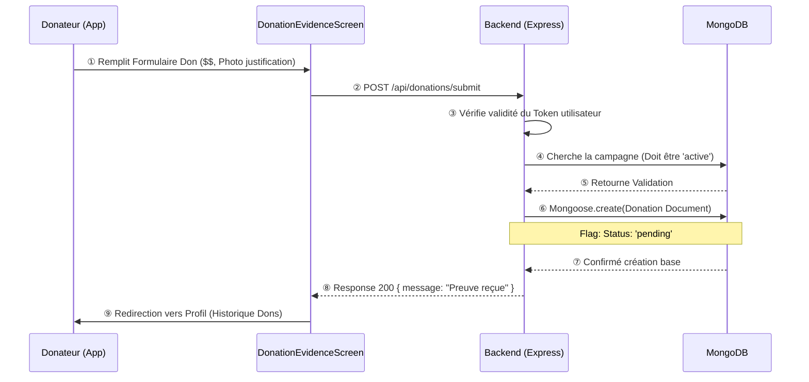
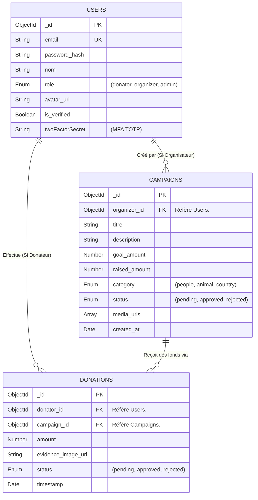
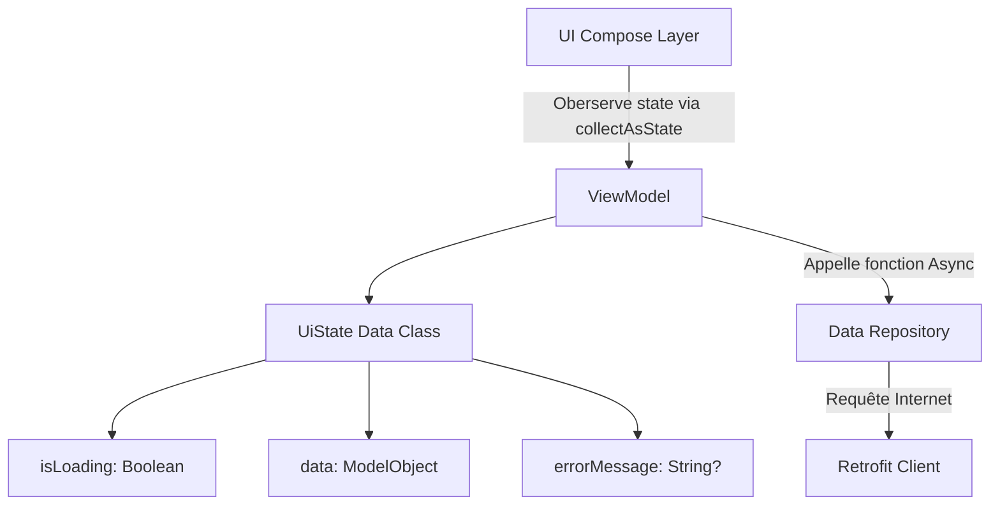
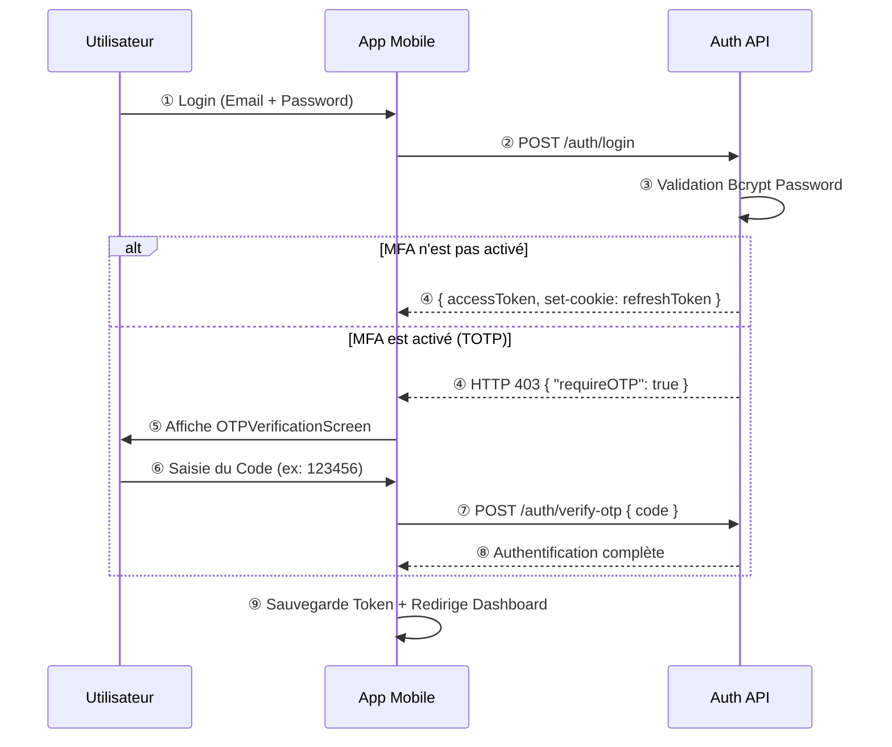

# Documentation Technique et Fonctionnelle Complète - AidUp

## 1. Vue d'Ensemble de l'Application

- **Titre du l'Application** : AidUp
- **Description** : Plateforme mobile moderne dédiée au soutien caritatif, permettant la mise en relation entre donateurs et causes humanitaires, animales ou régionales.
- **Objectif Principal et Problématique** : Centraliser, vérifier et sécuriser la levée de fonds pour des urgences mondiales (guerres, catastrophes naturelles) ou des associations locales (refuges), en offrant une transparence totale et une expérience utilisateur sans friction.
- **Public Cible** : 
  - *Particuliers (Donateurs)* : Personnes souhaitant contribuer financièrement à des causes fiables.
  - *Associations/ONG (Organisateurs)* : Entités certifiées ayant besoin d'une plateforme de visibilité et d'un tableau de bord de gestion de leurs financements.
- **Technologies Utilisées** :
  - *Frontend Mobile* : Android Natif (Kotlin), Jetpack Compose (Material Design 3), Navigation Compose, Retrofit (Réseau).
  - *Backend API* : Node.js, Express.js.
  - *Base de Données* : MongoDB (via Mongoose).
  - *Authentification* : JWT (Dual access/refresh tokens), TOTP (Multi-facteurs via Google Authenticator), WebSockets (QR Login).

---

## 2. Rôles et Matrices de Permissions

### Tableau des Rôles

| Rôle | Activités Principales | Permissions | Restrictions |
|------|----------------------|-------------|--------------|
| **Organisateur** | Création de campagnes, suivi analytique, gestion des donateurs, édition profil | CRUD sur ses propres campagnes, Vue intégrale sur les donateurs affiliés à ses causes | Ne peut pas approuver publiquement ses campagnes (nécessite un Admin). |
| **Donateur** | Découverte des causes, dons partiels ou complets, historique des donations | Lecture globale du catalogue, Écriture sur l'entité Don/Preuve, Édition de profil personnel | N'a aucun accès aux tableaux de bords d'édition de campagnes ou d'analyses. |
| **Admin** *(Système)* | Modération de contenu, validation KYC (Know Your Customer) pour associations | Accès complet aux statuts des utilisateurs et validation des campagnes | N'interagit pas via l'UI mobile publique (Dashboard Superuser ou backend exclusif). |

### Description Détaillée par Rôle

**ORGANISATEUR :**
- ✅ **Gestion du Profil et Vérification** : L'organisateur peut téléverser des documents légaux (statut associatif) via la `VerificationScreen` pour obtenir le badge de compte vérifié, renforçant la confiance.
- ✅ **Création et Édition de Campagnes** : À travers un formulaire multi-étapes (`CampaignCreationScreen`), il définit un titre, charge une vidéo/des images, configure un but financier (`goal_amount`) et associe une taxonomie (Catégorie).
- ✅ **Analyse et Suivi via Dashboard** : Accède au `OrganizerDashboardScreen` regroupant le ratio de campagnes réussies, le nombre de donateurs uniques sur son porte-feuille et le cumul des montants levés.

**DONATEUR :**
- ✅ **Exploration et Filtrage** : Le donateur accède à l'`HomeFeedScreen`. Il explore les campagnes par catégories (People, Animals, Regions).
- ✅ **Consultation Détaillée** : Lit le discours de l'organisateur, visionne les médias associés et consulte concrètement l'évolution de la jauge monétaire sur le `DetailsScreen`.
- ✅ **Soumission de Dons** : Lance le processus de contribution et dépose une preuve (capture d'écran de virement ou ticket de paiement) via le `DonationEvidenceScreen`.
- ✅ **Suivi et Historique** : Regarde depuis son profil l'état de ses dons (En attente d'approbation, Confirmé, Refusé).

---

## 3. Schémas Détaillés des Interfaces (STYLE M3 COMPOSE)

### 📱 Interface 1 : Page d'Accueil - Donateur (`HomeFeedScreen`)



**Wireframe de l'Interface :**
```text
    ┌──────────────────────────────┐
    │ 🧑 Header | Logo AidUp       │
    ├──────────────────────────────┤
    │ 🔍 Rechercher une cause...   │
    ├──────────────────────────────┤
    │ 📑 Toutes | Gens | Animaux   │
    ├──────────────────────────────┤
    │ 📜 Liste Campagnes           │
    │  ┌──────────────────────┐    │
    │  │ 🖼 Image de la cause │    │
    │  │ 📌 Titre + Orga      │    │
    │  │ ▃▃▃▃▃▃▃ 70%          │    │
    │  └──────────────────────┘    │
    │                              │
    │  ┌──────────────────────┐    │
    │  │ 🖼 Image de la cause │    │
    │  │ 📌 Titre + Orga      │    │
    │  │ ▃▃..... 30%          │    │
    │  └──────────────────────┘    │
    ├──────────────────────────────┤
    │ 🏠 Accueil | 🔍 Rech | 👤 Me │
    └──────────────────────────────┘
```

**Légende Détaillée :**
- **① App Top Bar** : Gérée nativement par Compose Material 3 `TopAppBar`, ancrée au sommet, transparente jusqu'au scroll.
- **② Search Bar** : Redirige subtilement vers le `SearchDiscoveryScreen` au focus.
- **③ Tab Row** : Contrôle l'état local filtrant la `LazyColumn`.
- **④ LazyColumn** : Liste performante en Kotlin gérant le recyclage des vues cellulaires automatiquement.
- **⑤ Cause Card** : Composant Compose réutilisable (`Composable`), Elevation 2dp, coins arrondis 16dp. Pésence d'un `LinearProgressIndicator` (progress bar).
- **⑥ Bottom Navigation** : `NavigationBar` MD3, permet un routage persistant (NavHost secondaire).

### 📱 Interface 2 : Détails de la Campagne - Donateur (`DetailsScreen`)



**Wireframe de l'Interface :**
```text
    ┌──────────────────────────────┐
    │ ⬅️                           │
    │                              │
    │       🖼 Carrousel Images    │
    │       (Swipe horizontal)     │
    │            • • ◦             │
    ├──────────────────────────────┤
    │ 📌 Titre de la Campagne      │
    │ 🏷 Catégorie                 │
    │ ▃▃▃▃▃▃▃▃▃▃▃▃▃▃.... 80%       │
    │ 💰 8,000 / 10,000 €          │
    ├──────────────────────────────┤
    │ 👥 Organisateur Vérifié ✔️   │
    ├──────────────────────────────┤
    │ 📝 Description Longue...     │
    │    Lorem ipsum dolor         │
    │    sit amet.                 │
    ├──────────────────────────────┤
    │ 💖 FAIRE UN DON (Bouton)     │
    └──────────────────────────────┘
```

**Légende Détaillée :**
- **① Media Carousel** : Utilisation du composant `HorizontalPager` Compose.
- **② Floating Back Button** : Intercepte les événements de retour système (`BackHandler`).
- **③ Header Information** : Contient un texte formatté selon la localisation de la devise.
- **⑦ Bottom Sticky App Bar** : Bouton d'action principal de type `Button`. Ne disparaît pas au scroll. Mène directement au formulaire de versement.

### 📱 Interface 3 : Centre de Gestion - Organisateur (`OrganizerDashboardScreen`)

```mermaid
graph TB
    subgraph "DASHBOARD ORGANISATEUR"
        A[Header Organisation]
        B[Bouton d'Edition Settings]
        C[Grille Statistiques Rapides]
        D[Bouton Action Rapide (FAB)]
        E[Liste des Campagnes Créées]
        F[Item Gestion Campagne]
    end
    
    A -->|①| A1["① Profil Header\nAffiche: Image Organisation, Titre\nBadge: Statut Validation Admin"]
    B -->|②| B1["② Icon Button\nPosition: Haut-Droit\nOuvre: EditProfilScreen"]
    C -->|③| C1["③ Metrics Grid\nColonnes: 3\nAffiche: Donateurs Uniques, Ratio de succès, Total Collecté\nStyle: Surfaces plates avec textes chiffrés accentués"]
    D -->|④| D1["④ Floating Action Button (+)\nPosition: Position Bottom End\nAction: Ouvre CampaignCreationScreen\nThème: Primary Container color"]
    E -->|⑤| E1["⑤ Liste Tabulaire\nSelection: Actives vs Brouillons vs Clôturées\nAffichage dynamique"]
    F -->|⑥| F1["⑥ Campaign List Item\nAffiche: Titre, Miniature photo, Tag de statut (En cours/Rejetée)\nActions: Clic pour voir détail / Swipe pour Menu Édition"]
```

**Wireframe de l'Interface :**
```text
    ┌──────────────────────────────┐
    │ 🧑 Header Organisation       │
    │ ⚙ Bouton Paramètres         │
    ├──────────────────────────────┤
    │ 📊 Grille Statistiques       │
    │ 👥 Donateurs | 💰 Total      │
    │ 📈 Ratio de Succès           │
    ├──────────────────────────────┤
    │ 📜 Liste Mes Campagnes       │
    │  ┌──────────────────────┐    │
    │  │ 🖼 Image + Titre       │    │
    │  │ 🏷 Statut (En cours)   │    │
    │  └──────────────────────┘    │
    ├──────────────────────────────┤
    │ ➕ FAB (Créer campagne)      │
    └──────────────────────────────┘
```

**Légende Détaillée :**
- **① Profil Header** : L'image et les informations principales de l'organisation.
- **② Icon Button** : Permet l'accès aux paramètres (édition du compte).
- **③ Metrics Grid** : Chiffres de performance mis en évidence.
- **④ Floating Action Button (+)** : Le bouton de départ pour le flux de validation de campagne (Création).
- **⑤ Liste Tabulaire** : Gère les filtres locaux sur les items.
- **⑥ Campaign List Item** : La carte elle-même contenant les options interactives.

---

## 4. Architecture et Flux de Données Backend

### 📊 Diagramme Architecture Globale

```mermaid
graph LR
    subgraph "FRONTEND KOTLIN (ANDROID)"
        A[UI Compose Screens]
        B[ViewModels (State Holders)]
        C[Retrofit / OkHttp (Network)]
        D[DataStore / EncryptedSharedPreferences]
    end
    
    subgraph "BACKEND API (NODE.JS)"
        E[Express Router Gateway]
        F[Auth & MFA Middleware]
        G[Campaign Domain]
        H[Donation Domain]
        I[Socket.io (Temps Réel)]
    end
    
    subgraph "DONNÉES & MÉDIAS"
        J[(MongoDB Database)]
        K[Stockage Local / CDN Médias]
    end
    
    A -->|① UI Events| B
    B -->|② Coroutines Flow| C
    B -->|③ Lire/Ecrire localement| D
    C -->|④ HTTP REST/JSON| E
    C -->|⑤ WebSocket Auth| I
    E -->|⑥ Check Headers (JWT)| F
    F -->|⑦ Route Dispatch| G
    F -->|⑦ Route Dispatch| H
    G -->|⑧ CRUD Operations via Mongoose| J
    H -->|⑧ CRUD Operations via Mongoose| J
    G -->|⑨ Enregistrement Médias| K
```

**Annotations du Flux :**
- **① UI → ViewModels** : Interaction pilotée par des événements (Event-driven unidirectional flow).
- **② ViewModels → Network** : Appels asynchrones Kotlin `suspend functions` traitant en arrière-plan.
- **③ State → Local** : Stockage persistant et chiffré des jetons (Refresh Token, App Theme).
- **④-⑤ API Requests** : Communication internet externe. `Socket.io` utilisé spécifiquement pour le process "QR Login".
- **⑥ Middleware Auth** : Tout endpoint sensible décrypte l'entête HTTP `Authorization: Bearer <token>`.
- **⑧ Database** : Requêtes NoSQL vers des collections MongoDB (Documents JSON enrichis).

### 🔄 Diagramme de Séquence : Création d'Événement par l'Organisateur



**Détails Techniques (Création d'Événement) :**
- **Étape ⑦** : La requête Retrofit passe en `MultipartBody.Part` car elle transporte du texte pur et des octets d'images simultanément.
- **Étape ⑧** : Le Node.js Backend vérifie strictment la décodification du JWT. S'il n'est pas "Organisateur", retourne HTTP 403.
- **Étape ⑩** : L'état par défaut est stocké en DB avec le flag `pending` pour s'assurer qu'il n'aille pas sur le "Home Feed" avant approbation d'un Administrateur.

### 🔄 Diagramme de Séquence : Soumission d'un Don



---

## 5. Modèles de Données et Relations (Logique Métier)

### 📋 Diagramme Entité-Relation (ER - MongoDB Structure)

Bien qu'implémentée via MongoDB (NoSQL), la couche Mongoose force les relations logiques documentaires entre les collections :



**Annotations des Relations :**
- **① USERS → CAMPAIGNS (1:N)** : Un profil `organizer` agrège via son `_id` plusieurs instances de campagnes dans la collection `Campaigns`.
- **② USERS → DONATIONS (1:N)** : Un profil `donator` peut soumettre x reçus de donations. Lié par `donator_id`.
- **③ CAMPAIGNS → DONATIONS (1:N)** : Un objet Campagne stocke un compteur financier (`raised_amount`) calculé en agrégeant (ou confirmant manuellement) toutes les donations validées pointant sur son `campaign_id`.

---

## 6. Gestion de l'État et Cache

### État Local Native Kotlin (State Management)

AidUp utilise la puissance de **Kotlin StateFlow** et Jetpack Compose pour assurer un rafraichissement réactif sans gel d'image.



### Stratégie de Cache Réseau
- **Mise en cache OkHttp** : Configurées dans Retrofit. Les images (Avatars, bannières campagnes) utilisent le cache de la bibliothèque Image-loading (ex. *Coil*) permettant d'enregistrer sur le ROM l'image avec un validateur Etag.
- **Réduction de charge** : L'application recharge la liste globale (Home Feed) "à la demande" utilisateur via un rafraichissement (SwipeRefresh layout). 

---

## 7. Sécurité et Authentification

### 🔐 Flux d'Authentification Avancé



**Mesures de Sécurité Strictes :**
- ① **Mots de passe** : Hachage fort Bcrypt avant insertion en base de données.
- ② **Architecure Jetons** : L'`Access Token` (JWT) a un court TTL (Time-to-Live de 15mins). Le `Refresh Token` est protégé.
- ③ **Chiffrement Stockage Mobile** : Le jeton Bearer enregistré côté Kotlin s'effectue strictement via les `EncryptedSharedPreferences` tirant parti de *l'Android Keystore*.
- ④ **Authentification via QR (Cross Device)** : L'implémentation inclut un scanneur caméra qui fait le relai `Socket.io` afin d'injecter sécuritairement les jetons de sessions directement du mobile vers un terminal web, sans transporter les identifiants clés.

---

## 8. Gestion des Erreurs

Une gestion modélisée centralise l'exception dans un "Network Error Interceptor" sous Kotlin.

| Code | Type API | Message (UI Kotlin) | Action Frontend |
|------|------|-------------------|----------------|
| **400** | ValidationError | "Données invalides ou manquantes." | Rejet du formulaire, surbrillance rouge (`isError=true`) des `OutlinedTextField` responsables. |
| **401** | Unauthorized | "Session expirée. Veuillez vous reconnecter." | Suppression immédiate du cache local, déconnexion forcée → Redirection root vers `LoginScreen`. |
| **403** | Forbidden | "Accès restreint aux organisateurs/admins." | Affichage d'un `Snackbar` d'interruption et rollback discret de vue. |
| **404** | Not Found | "Cette campagne n'existe plus." | Pop de la route actuelle `navController.popBackStack()`. |
| **500** | Server Error | "Un souci technique est survenu côté serveurs AidUp." | Maintien et proposition d'un bouton `Retry` centré sur l'écran. |

---

## 9. Performance et Optimisations

**Aspects UI / Fonctionnels (Kotlin) :**
- ① **Lazy Loading des Composants** : `LazyColumn` ne charge que les composants visibles à l'écran, supprimant de la mémoire la sur-composition.
- ② **Chargement Asynchrone des Images** : L'utilisation de compose native asynchrone permet que les très grandes images de la campagne soient réduites (Downsized) à la largeur du mobile avant intégration en VRAM.
- ③ **Coroutines Structurées** : Les appels HTTPS lourds tournent exclusivement sur le dispatch `Dispatchers.IO` empêchant l'applet (Dispatch Main) d'observer le moindre gel d'animation UI (Frame drop 60fps garants).

**Aspects Backend (Node.js/Express) :**
- ① **Indexation NoSQL** : L'attribut `.index()` Mongoose est placé sur les champs `category` ou `status` des campagnes pour drastiquement réduire la latence des appels de liste et de filtrage grand public.
- ② **Optimisation d'Image (Multer)** : Restrictions de la limite du `Payload` HTTPS lors de la soumission de pièces justificatives (Mo limité) pour interdire la paralysie réseaux.
- ③ **Nettoyage Automatique** : Tâches planifiées (cron jobs internes) désapprouvant/nettoyant des sessions inactives ou expurgant les campagnes rejetées d'office depuis plusieurs mois.
